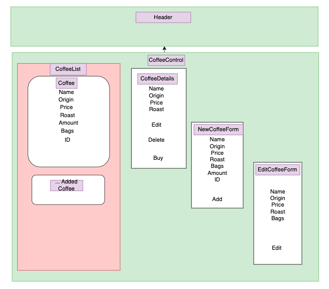

# inventory-tracker

#### A client side application showcasing full CRUD (Create, Read, Update, Delete) functionality in a React application

#### By Christopher Davila

## Technologies Used

* _React_
* _JSX_
* _Node.js_
* _javascript_
* _Html_
* _Bootstrap_

## Description
* Application to sell and track inventory for a coffee company.  Client can create, read, update and delete entries, add 130 pound bags to the inventory and sell single pounds of coffee. The application will not allow consumer to buy coffee once amount of inventory is at 0.  Code review for Reacts Basics section

## Diagram
* below is a diagram created on draw.io to demonstration the component/prop relationships of this application:

## Setup/Installation Requirements

* 1. Clone this repo using `\$ git clone https://github.com/ChrisRDavila/inventory-tracker.git`
to clone the GitHub repository.
* 2. Open your terminal (e.g., Terminal or GitBash) and navigate to the correct directory using `\$ cd inventory-tracker` and run "npm install" to download all the package dependencies.
* 3. Next run "npm run start" to start the server. Once the server loads, the webpage should load automatically but if not type in the localhost route that your terminal shows like `https://localhost:3000/`.
* 4. Once launched follow prompts to Create, Read, Update and Delete entries using the the form input provided.

## Available Scripts

In the project directory, you can run:

### `npm start`

Runs the app in the development mode.\
Open [http://localhost:3000](http://localhost:3000) to view it in your browser.

The page will reload when you make changes.\
You may also see any lint errors in the console.

### `npm test`

Launches the test runner in the interactive watch mode.\
See the section about [running tests](https://facebook.github.io/create-react-app/docs/running-tests) for more information.

### `npm run build`

Builds the app for production to the `build` folder.\
It correctly bundles React in production mode and optimizes the build for the best performance.

The build is minified and the filenames include the hashes.\
Your app is ready to be deployed!

See the section about [deployment](https://facebook.github.io/create-react-app/docs/deployment) for more information.

### `npm run eject`

**Note: this is a one-way operation. Once you `eject`, you can't go back!**

If you aren't satisfied with the build tool and configuration choices, you can `eject` at any time. This command will remove the single build dependency from your project.

Instead, it will copy all the configuration files and the transitive dependencies (webpack, Babel, ESLint, etc) right into your project so you have full control over them. All of the commands except `eject` will still work, but they will point to the copied scripts so you can tweak them. At this point you're on your own.

You don't have to ever use `eject`. The curated feature set is suitable for small and middle deployments, and you shouldn't feel obligated to use this feature. However we understand that this tool wouldn't be useful if you couldn't customize it when you are ready for it.

## Known Bugs

* _No Known Bugs_

## License
[MIT](https://github.com/ChrisRDavila/inventory-tracker/blob/main/License.txt)
